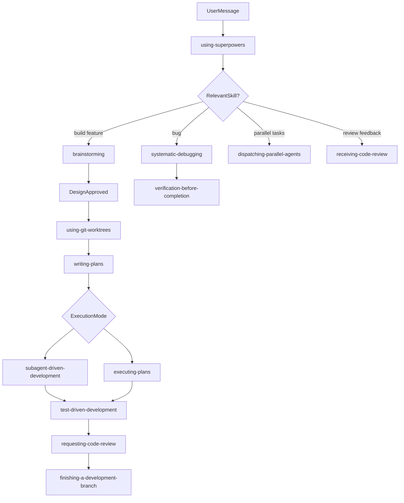
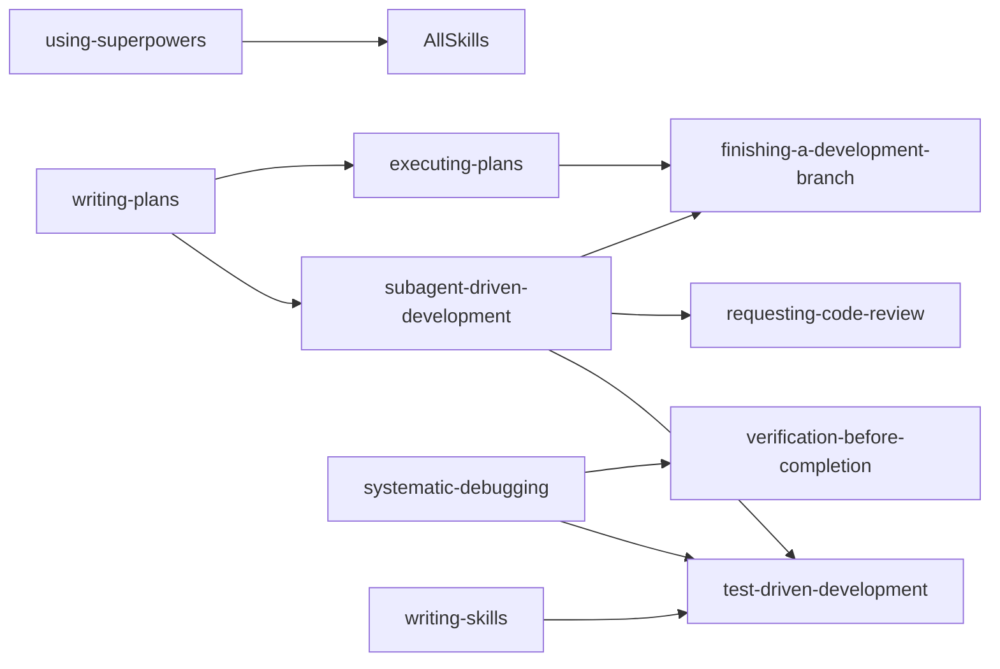

# Architecture Analysis

## 1. System Overview

Superpowers is a **plugin** that bundles skills, hooks, agents, and commands. On Cursor, configuration lives in `.cursor-plugin/plugin.json`:

```json
{
  "name": "superpowers",
  "version": "5.1.0",
  "skills": "./skills/",
  "hooks": "./hooks/hooks-cursor.json"
}
```

## 2. Workflow Directed Acyclic Graph



## 3. Bootstrap Layer: Session Hook

On session start, `hooks/session-start` injects the full `using-superpowers` skill into agent context:

```
CURSOR_PLUGIN_ROOT set → JSON { "additional_context": "<EXTREMELY_IMPORTANT>...using-superpowers...</EXTREMELY_IMPORTANT>" }
```

Verified in this study:

```bash
export CURSOR_PLUGIN_ROOT="$(pwd)/vendor/superpowers"
bash vendor/superpowers/hooks/session-start  # → PASS
```

The hook establishes:

1. Skills must be invoked before any response
2. Priority: user instructions > superpowers skills > default prompt
3. Red-flag rationalization table for skipping skills

## 4. Skill Discovery (CSO)

Agents select skills by reading YAML `description` fields. Critical design rule from `writing-skills`:

> **Description = When to Use, NOT What the Skill Does**

Summarizing workflow in descriptions causes agents to follow the short description instead of reading the full skill body—a documented failure mode.

## 5. Skill Dependency Graph



## 6. Multi-Harness Plugin Design

Superpowers ships harness-specific entry points:

| Harness | Install path | Hook format |
|---------|--------------|-------------|
| Claude Code | Plugin marketplace | `hookSpecificOutput.additionalContext` |
| Cursor | `/add-plugin superpowers` | `additional_context` (snake_case) |
| Codex | Plugin marketplace | Platform-specific |
| Gemini | Extension install | `activate_skill` tool |
| OpenCode | Custom INSTALL.md | Separate |

Single skill source (`skills/`) with platform adapters in hooks and reference docs (`references/copilot-tools.md`, `references/gemini-tools.md`).

## 7. Enforcement Mechanisms

| Mechanism | Type | Strength |
|-----------|------|----------|
| Session hook injection | Automatic | High at session start |
| Skill descriptions (CSO) | Discovery | Medium—depends on agent compliance |
| Rationalization tables | Documentation | Medium—requires agent self-check |
| Red-flag lists | Documentation | Medium |
| Iron Law (writing-skills) | Meta-process | Applies to skill authors, not runtime |
| User rules (AGENTS.md) | Override | Highest priority |

## 8. Token Budget Architecture

`writing-skills` specifies targets:

- Frequently-loaded skills: <200 words
- Other skills: <500 words (SKILL.md body)
- Progressive disclosure: heavy reference in separate files

**Observation:** Several skills exceed word targets (see skill catalog). `writing-skills` at 3212 words is intentionally meta-heavy.

## 9. Cursor-Specific Architecture Gaps

| Gap | Impact |
|-----|--------|
| `Skill` tool referenced in `using-superpowers` | Cursor uses plugin skill loading + Read |
| Subagent naming (`superpowers:implementer`) | Cursor Task tool uses different subagent types |
| No Cursor reference doc in upstream | Agents may mis-map tools |
| `brainstorming` description uses "MUST" not "Use when" | CSO pattern deviation; may over-trigger |
