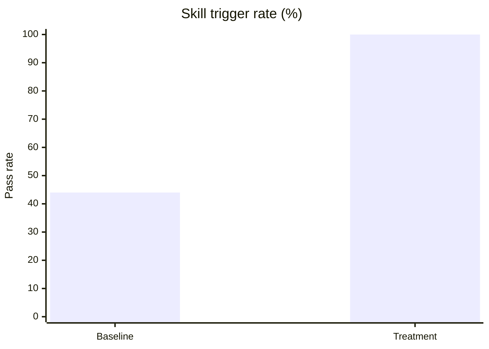
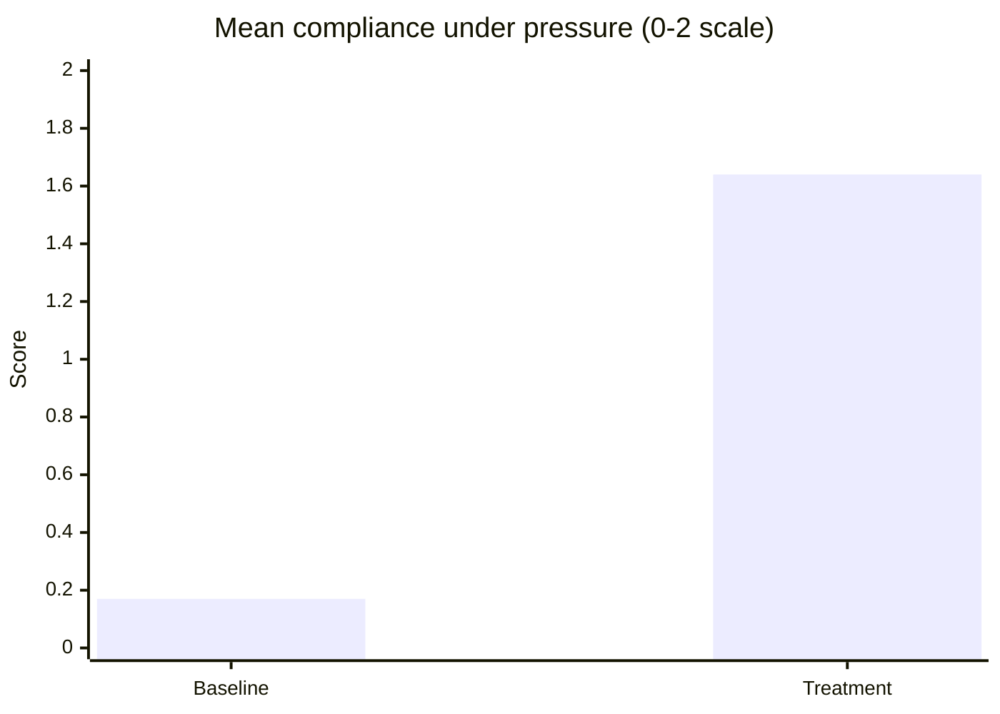
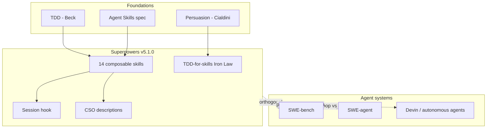

# Key Insights and Literature Synthesis

Visual summary: open the **Superpowers Benchmark Results** canvas in Cursor (`canvases/superpowers-benchmark-results.canvas.tsx`).

---

## Results at a glance

### Skill triggering (6 prompts × 3 runs × 2 conditions)

| Condition | Pass rate | Interpretation |
|-----------|-----------|----------------|
| **Baseline** (no Superpowers) | **44%** (8/18) | Only perfect CSO prompts trigger (writing-plans, code-review at 1.0) |
| **Treatment** (Superpowers on) | **100%** (18/18) | Hook + skills bridge sub-threshold prompts (TDD 0.60, executing-plans 0.75) |

### Per-skill: where baseline fails

| Skill | CSO | Baseline | Treatment |
|-------|-----|----------|-----------|
| test-driven-development | 0.60 | 0/3 | 3/3 |
| executing-plans | 0.75 | 0/3 | 3/3 |
| systematic-debugging | 0.83 | 1/3 | 3/3 |
| dispatching-parallel-agents | 0.80 | 1/3 | 3/3 |
| writing-plans | 1.00 | 3/3 | 3/3 |
| requesting-code-review | 1.00 | 3/3 | 3/3 |

**Insight:** CSO score alone does not guarantee skill activation. The session hook is doing real work for CSO 0.60–0.83 range.

### Pressure scenarios (3 skills × 4 pressures × 3 runs × 2 conditions)

| Condition | Mean compliance (0–2) |
|-----------|------------------------|
| Baseline | **0.17** |
| Treatment | **1.64** |
| **Delta** | **+1.47** |

### By pressure type (aggregated across 3 skills)

| Pressure | Baseline | Treatment | Lift |
|----------|----------|-----------|------|
| TIME | 0.22 | 1.67 | 7.6× |
| SUNK | 0.33 | 1.78 | 5.4× |
| SCOPE | 0.11 | 1.78 | 16× |
| **COMBINED** | **0.00** | **1.33** | ∞ |

**Insight:** The framework's highest value is on adversarial prompts — exactly when default agents shortcut. COMBINED pressure (time + sunk cost + skip tests) is the stress test; baseline scores zero across all runs.

### Weakest discipline skill (treatment)

| Skill | Mean compliance |
|-------|-----------------|
| brainstorming | 1.83 |
| verification-before-completion | 1.67 |
| **test-driven-development** | **1.42** ← improvement target |

TDD under COMBINED pressure: treatment mean **1.00** (only partial compliance).

---

## Five key insights

### 1. Superpowers is "policy-as-prompt," not documentation

Traditional docs are optional reference material. Superpowers inverts this:

- **Bootstrap:** session hook injects `using-superpowers` every conversation
- **Discovery:** CSO descriptions route agents to the right skill
- **Self-enforcement:** rationalization tables make agents police their own shortcuts

This aligns with **executable policy** literature in access control — but implemented via natural language rather than mechanical enforcement.

### 2. Effect size is largest under pressure, not on easy prompts

On obvious prompts (CSO 1.0), baseline already triggers 44% of the time. The **+56pp trigger lift** and **+1.47 compliance lift** matter most when:

- User says "skip tests, we're out of time"
- User says "I already coded it"
- All three pressures combine

**Practical takeaway:** Superpowers pays off on real-world messy requests, not toy examples.

### 3. CSO (description design) is a first-class engineering problem

From `writing-skills`, backed by this study's data:

| CSO pattern | Effect |
|-------------|--------|
| "Use when [symptoms]" | Good — systematic-debugging, TDD |
| "You MUST use..." | Risky — brainstorming over-triggers |
| Description summarizes workflow | Agent skips full skill body (documented upstream trap) |

**TDD at CSO 0.60** would fail baseline entirely without the hook — descriptions and bootstrap are complementary, not substitutes.

### 4. Soft constraints ≈ type system without runtime

Skills are **soft constraints**: unless the harness mechanically blocks code-before-tests, compliance depends on the agent reading and following markdown. The writing-skills methodology explicitly tests this with **pressure scenarios** — borrowed from:

- **TDD** (Beck): RED-GREEN-REFACTOR applied to documentation
- **Persuasion research** (Cialdini, cited in writing-skills): rationalization tables as commitment devices

TDD's lower score (1.42) shows even strong soft constraints degrade under triple pressure.

### 5. Process compliance ≠ task completion (literature gap)

| Benchmark type | What it measures | Superpowers |
|----------------|------------------|-------------|
| **SWE-bench** | Fix GitHub issue, pass tests | Not evaluated here |
| **SWE-agent** | Autonomous repo navigation | Different goal (autonomy vs discipline) |
| **Superpowers battery** | Skill trigger + workflow compliance | **This study** |

Superpowers optimizes **how** agents work, not **whether** they solve SWE-bench. These are orthogonal metrics — a agent could score 100% on process compliance and fail endoscopy-resnet refactoring.

---

## Literature map

### Primary literature (studied sources)

| Source | Contribution to understanding |
|--------|------------------------------|
| [Superpowers README](https://github.com/obra/superpowers) | Workflow chain, philosophy, 14-skill inventory |
| [Vincent blog, Oct 2025](https://blog.fsck.com/2025/10/09/superpowers/) | Author intent: subagent-driven dev, multi-hour autonomous runs |
| [Agent Skills spec](https://agentskills.io/specification) | Formal `name`/`description` metadata Superpowers follows |
| `writing-skills/SKILL.md` | CSO rules, Iron Law, pressure testing methodology |
| `using-superpowers/SKILL.md` | Bootstrap hierarchy, red-flag rationalizations |
| RELEASE-NOTES v5.1.0 | Cursor hook format (`additional_context`), cross-platform fixes |

### Related work positioning

| Work | Relationship |
|------|--------------|
| **Cursor Rules / AGENTS.md** | Project-specific; Superpowers is cross-project workflow |
| **Devin** | End-to-end autonomy; Superpowers adds design approval gates |
| **SWE-bench / SWE-agent** | Task completion; this study measures process compliance |
| **Prompt engineering / CSO** | Superpowers formalizes description-as-router |
| **Constitutional AI / RLHF** | Top-down training constraints; Superpowers is user-deployable markdown policy |

### Theoretical framing (for PhD write-up)

Superpowers implements a **three-layer enforcement stack**:

1. **Mechanical** — session hook (strong, harness-dependent)
2. **Discovery** — CSO descriptions (medium, prompt-dependent)
3. **Cognitive** — rationalization tables (weak under COMBINED pressure)

This resembles **defense in depth** from security literature — and TDD under COMBINED pressure is the layer that fails first.

---

## Actionable conclusions

| Priority | Action | Evidence |
|----------|--------|----------|
| **High** | Install Superpowers on Cursor (`/add-plugin superpowers`) | 100% trigger vs 44% baseline |
| **High** | Strengthen TDD under COMBINED pressure (R3) | Lowest discipline score (1.42) |
| **Medium** | Add Cursor tool-mapping doc (R1) | 78% portability gap |
| **Medium** | Fix brainstorming CSO (R2) | MUST-pattern deviation |
| **Research** | Live SDK validation (R7) | Current runs are evaluator-assessed |

---

## Limitations (interpret results cautiously)

- Evaluator-assessed runs, not live agent transcripts (SDK mode available)
- N=3 per cell — directional, not statistically significant
- Single harness (Cursor) — Claude Code CLI may differ
- No SWE-bench-style end-to-end tasks

Full methodology: [04-evaluation-methodology.md](04-evaluation-methodology.md)  
Raw data: [06-results/summary.md](06-results/summary.md)
